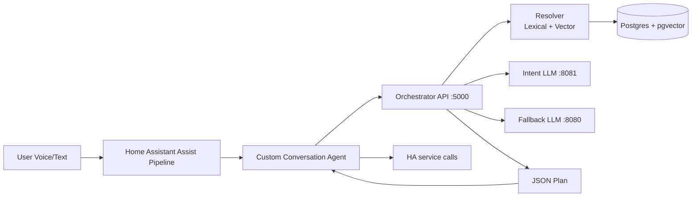
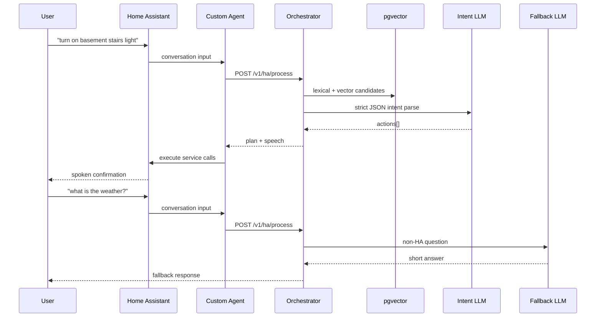

# Deterministic HA Voice Agent

Deterministic-first voice control for Home Assistant:
- resolve entities with lexical + vector retrieval,
- parse intent with a small local LLM,
- enforce safety gates,
- use a general LLM only for non-home-automation questions.

## ELI15

Think of this like a smart home referee:
1. You say: "turn on basement lights".
2. The referee checks a local list of your devices (fast, deterministic).
3. A small model picks the exact action from those candidates only.
4. Safety rules block dangerous stuff or ask follow-up questions.
5. If your question is not about devices ("what's the weather?"), it sends it to a chat model.

Result: fewer wrong-device actions than "just ask one giant LLM to guess everything."

## Pro Version

### Goals
- Deterministic entity resolution.
- Strict JSON action plans.
- Safety-first execution boundaries.
- HA-native conversation integration.

### Architecture

### Request Flow

### Safety Model
- Domain allowlist + blocklist.
- Clarify when confidence is low.
- Clarify when top candidates are too close.
- Confirmation gates for risky targets.
- Action cap per request.

## Repo Layout

- `orchestrator/`: Go API (`/v1/ha/process`, `/healthz`)
- `sync_entities.py`: entity catalog sync + embedding generation
- `homeassistant/custom_components/deterministic_agent/`: HA integration scaffold
- `systemd/`: deployment units (`pgvector`, `intent-llm`, `deterministic-agent`, sync timer)

## Quick Start

1. Deploy orchestrator + sync script to your LLM host (`/opt/ha-deterministic-agent/`).
2. Configure env files in `/etc/ha-deterministic-agent/`.
3. Install `systemd/*.service` and `systemd/*.timer`.
4. Copy `homeassistant/custom_components/deterministic_agent/` into HA `custom_components`.
5. Restart HA core and select the custom conversation engine in Assist pipeline.

## Runtime Endpoints

- `POST /v1/ha/process`
- `GET /healthz`

## Validation Matrix

- Exact device action resolves correctly.
- Ambiguous command requests clarification.
- Blocked domain does not execute.
- Non-HA question routes to fallback LLM.

## Notes

- CPU SIMD: AVX2 is typically the practical max on many Intel consumer CPUs; AVX-512 may be unavailable.
- Most acceleration comes from llama.cpp/CUDA and pgvector indexing, not from orchestrator language choice.
