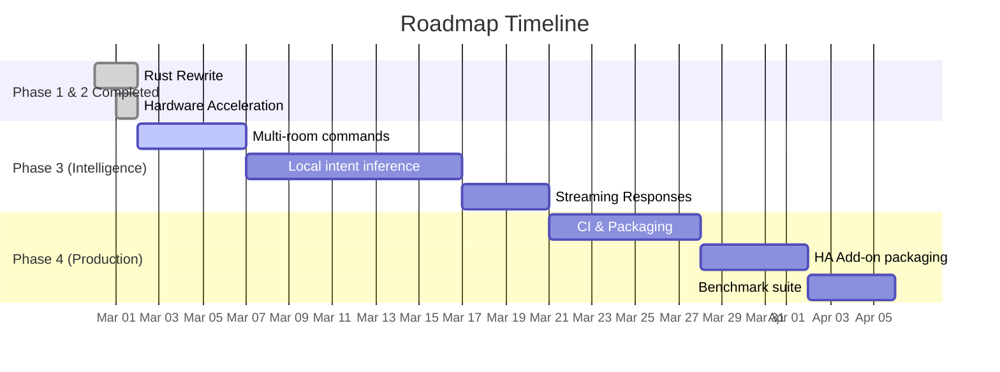

# Deterministic HA Voice Agent — Roadmap

> **Current state:** Orchestrator fully rewritten in Rust. Legacy Go code removed. Python entity sync replaced with native Rust daemon. Successfully deployed with hardware acceleration!

---

## Phase 1 — Hardening & Repo Cleanup *(Completed)*

| # | Item | Status | Notes |
|---|------|--------|-------|
| 1 | **Update README** | ✅ | Swapped Go badge → Rust badge, updated repo layout |
| 2 | **Port `sync_entities.py` to Rust** | ✅ | Eliminated Python dependency, added `sync` subcommand |
| 3 | **Rewrite systemd units** | ✅ | Pointed `deterministic-agent.service` at the Rust binary |
| 4 | **CI pipeline (GitHub Actions)** | ⏳ | `cargo test`, `cargo clippy`, cross-compile for AVX2/aarch64 |
| 5 | **Dockerize** | ⏳ | Multi-stage builder with `target-cpu=native`, CUDA variant |
| 6 | **Integration test harness** | ✅ | Mock pgvector + mock LLM endpoints; full request flow tested |

---

## Phase 2 — Performance & Acceleration *(Mostly Completed)*

| # | Item | Status | Notes |
|---|------|--------|-------|
| 7 | **`simd-json` hot path** | ✅ | Replaced `serde_json` for AVX2/512 acceleration |
| 8 | **In-process embedding inference** | ✅ | Embedded `all-MiniLM-L6-v2` via ONNX Runtime (`ort`) |
| 9 | **In-memory entity cache** | ✅ | Cached catalog in `DashMap` with TTL. Invalidated on sync |
| 10 | **Connection pooling tuning** | ⏳ | Adaptive sizing based on request rate (`sqlx` metrics) |
| 11 | **Batch vector ops with `multiversion`** | ✅ | Cosine-similarity kernels dispatched at runtime |
| 12 | **Tracing & metrics** | ⏳ | `tracing` spans per stage → export to Prometheus/Grafana |

---

## Phase 3 — Intelligence & Features *(In Progress)*

| # | Item | Status | Notes |
|---|------|--------|-------|
| 13 | **Conversation memory** | ✅ | Per-`conversation_id` context window for follow-up commands |
| 14 | **Multi-room commands** | ⏳ | Parse "turn off all lights downstairs" → batch action |
| 15 | **Configurable safety policies** | ✅ | Loaded safety rules from TOML config file |
| 16 | **Streaming LLM responses** | ⏳ | SSE/WebSocket streaming for GLM fallback |
| 17 | **Local intent model (ONNX)** | ⏳ | Run `qwen2.5-1.5b-instruct` locally via ONNX Runtime |
| 18 | **HA WebSocket API** | ✅ | Switched from REST to HA WebSocket for real-time updates |

---

## Phase 4 — Production & Scale *(Upcoming)*

| # | Item | Status | Notes |
|---|------|--------|-------|
| 19 | **TLS termination** | ⏳ | Built-in `rustls` listener for direct HTTPS |
| 20 | **Multi-instance / HA clustering** | ⏳ | Stateless orchestrator behind a load balancer |
| 21 | **Custom HA add-on** | ⏳ | Package as a Home Assistant Community Add-on |
| 22 | **Nix / Homebrew packaging** | ⏳ | Easy install on macOS and NixOS |
| 23 | **Benchmarking suite** | ⏳ | Automated latency and throughput benchmarks (`criterion`) |
| 24 | **Plugin system** | ⏳ | Trait-based plugin architecture |

---

## Milestone Summary

